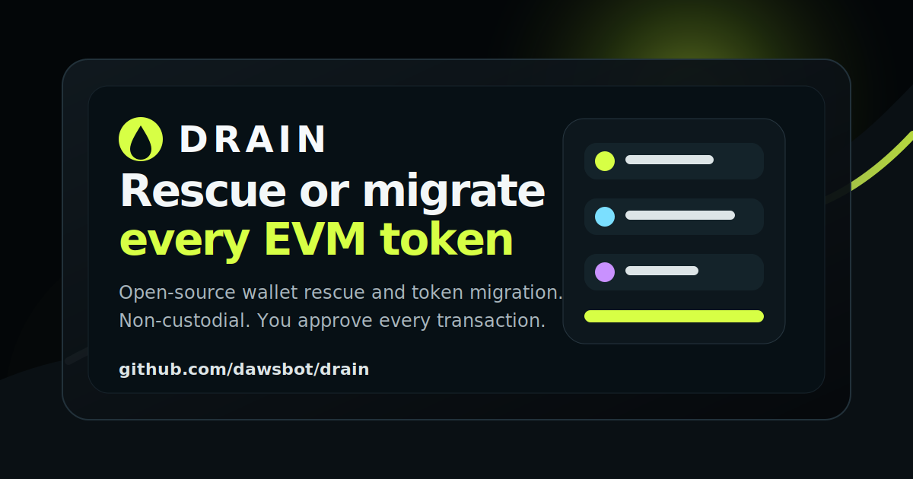

# 🫗 Drain

**Drain is an open-source EVM wallet rescue and token migration tool.** Move native gas tokens and ERC-20s from one wallet to another quickly when you are migrating wallets, consolidating long-tail assets, or rescuing funds from a wallet you still control.

> Non-custodial. Open source. You connect your own wallet and approve every transaction.

[](https://github.com/dawsbot/drain/stargazers)
[](https://github.com/dawsbot/drain/forks)

- **App:** https://drain-tokens.vercel.app/
- **Source:** https://github.com/dawsbot/drain
- **Original ETHGlobal project:** https://ethglobal.com/showcase/drain-6f9sc



---

## Why Drain exists

Moving a crypto wallet is still too manual. If you have a wallet full of small ERC-20 balances across EVM networks, you usually have to:

1. Find every token.
2. Open each token contract or wallet asset page.
3. Copy the new destination address repeatedly.
4. Sign one transfer after another.
5. Hope you did not miss dust, long-tail tokens, or the native gas token.

Drain turns that into a focused rescue/migration flow: connect the source wallet, review discovered tokens, choose what to move, enter a destination, and sign the transfers.

## When should I use Drain?

Drain is built for situations like:

- **Wallet migration:** You are retiring an old wallet and moving assets to a new one.
- **Compromised-wallet response:** You may be compromised, but you still have signing access and need to move assets quickly.
- **Asset consolidation:** You have long-tail ERC-20s or dust spread across an EVM wallet.
- **Transparent recovery workflow:** You want an open-source alternative to one-off scripts or opaque websites.

Drain is **not** a seed phrase recovery service, private-key recovery tool, mixer, custody product, or way to move assets you do not own or control.

## What Drain does

- Connects to your wallet with RainbowKit / Wagmi.
- Reads token balances for the connected wallet.
- Shows token logos, balances, and estimated USD value.
- Lets you select the assets you want to move.
- Resolves ENS names for destination addresses.
- Transfers selected ERC-20 tokens to your destination wallet.
- Handles native gas tokens with value transfers while reserving gas.
- Attempts an atomic batched transfer when the wallet supports it, then falls back to one-by-one transfers.

## What Drain does **not** do

- It does not ask for, store, or transmit your seed phrase or private key.
- It does not custody funds.
- It does not bypass wallet signatures.
- It does not guarantee recovery from wallets already controlled by an attacker.
- It does not currently recover NFTs.
- It should not be used to move assets you do not own or have permission to control.

## Safety checklist

Before using Drain, especially in a stressful compromised-wallet situation:

- Verify you are using the intended app URL or run the app locally.
- Confirm the destination address carefully before signing.
- Read each wallet prompt and verify the token, amount, and recipient.
- Start with a small test transfer when time allows.
- Keep enough native gas token for required transaction fees.
- If you believe your wallet is compromised, consider revoking approvals after moving assets.
- Move high-value assets first if you are racing an active attacker.

For more detail, review the safety checklist above and inspect the source before connecting valuable wallets.

## Run locally

Running locally is the best way to inspect exactly what the app does before connecting a wallet.

```bash
git clone https://github.com/dawsbot/drain.git
cd drain
npm install
cp .env.example .env.local
npm run dev
```

Then open http://localhost:3000.

Required environment variables:

```bash
NEXT_PUBLIC_WALLET_CONNECT_PROJECT_ID=
MORALIS_API_KEY=
```

- Get a WalletConnect project ID from https://cloud.walletconnect.com/.
- Get a Moralis API key from https://admin.moralis.io/.
- Keep `MORALIS_API_KEY` server-side: use `.env.local` for local development
  and the Vercel project environment for Preview and Production. Never prefix
  it with `NEXT_PUBLIC_` or commit the real value.

## Verify the project

```bash
npm run lint
npx tsc --noEmit
npm test
npm run build
```

The default test run skips live Moralis suites when `MORALIS_API_KEY` is not
configured. Add the key to the ignored `.env.local` file to run those live API
checks locally.

## Tech stack

- [Next.js](https://nextjs.org/)
- [React](https://react.dev/)
- [TypeScript](https://www.typescriptlang.org/)
- [RainbowKit](https://www.rainbowkit.com/)
- [Wagmi](https://wagmi.sh/)
- [Viem](https://viem.sh/)
- [Moralis](https://moralis.io/)
- [Jotai](https://jotai.org/)

## Architecture

```text
Wallet connection
  └─ RainbowKit / Wagmi

Token discovery
  └─ pages/api/chain-info/[chainId]/[evmAddress].ts
      └─ Moralis API

Token selection UI
  └─ components/contract/GetTokens.tsx
      └─ src/atoms/*

Transfer flow
  └─ components/contract/SendTokens.tsx
      ├─ ERC-20 transfer calls
      ├─ native token value transfers
      ├─ ENS destination resolution
      └─ batched sendCalls when supported
```

## Contributing

Contributions are welcome, especially around safety, chain support, simulation, and wallet UX.

Good areas to improve:

- Add a clearer pre-signing simulation screen.
- Improve compromised-wallet mode and safety guidance.
- Expand network support documentation.
- Add NFT rescue support.
- Improve mobile WalletConnect flows.
- Add more automated tests for token discovery and transfer edge cases.

Local workflow:

```bash
npm install
npm run lint
npx tsc --noEmit
npm test
```

Please keep security-sensitive UX conservative: users should always know exactly what token, amount, destination, and network they are signing for.

## Responsible use

Drain is intended for moving assets that you own or are authorized to control. Do not use this project for theft, phishing, unauthorized transfers, or deception. The maintainers do not endorse malicious use.

## Roadmap ideas

- Dedicated compromised-wallet rescue mode.
- Transaction simulation before signing.
- NFT discovery and transfer support.
- Approval revoke integrations after rescue.
- Better multi-chain sweep flow.
- More detailed network support matrix.
- Local-only / self-hosted mode docs.

## History

Drain began as an ETHGlobal project and has continued as an open-source wallet migration and rescue tool.

Read the original project page: https://ethglobal.com/showcase/drain-6f9sc

## License

See repository license information before reuse.
